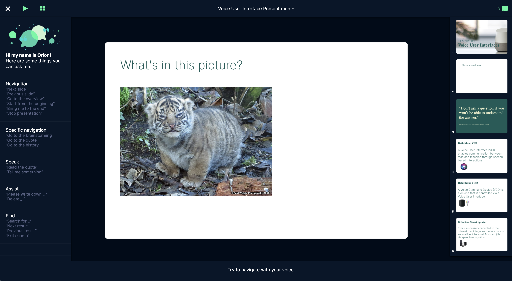

# Orion Readme 🪐

Orion ist ein Voice User Interface, welches dir ermöglicht mit Sprachbefehlen intuitiver und interaktiver durch deine Keynotes zu navigieren. Über die Erkennung von Keywords merkt die AI wann der richtige Zeitpunkt ist, um beispielsweise Videos abzuspielen, Datengrafiken anzuzeigen, oder Stichpunkte auf Folien zu ergänzen.

## Base Setup

Unser HTML/CSS JavaScript Prototyp besteht aus einer vorgefertigten Präsentation, welche auf das durchnavigieren mit Orion optimiert ist. Der Prototyp ist für Chrome optimiert, in anderen Browsern könnte es sein, dass gewisse Dinge nicht funktionieren. Ist die Präsentation in Chrome geöffnet, muss noch Zugriff auf das Mikrofon gewährt werden und die Präsentation ist bereit gestartet zu werden.

Die momentan aktuellste Version kann hier abgerufen werden: 

